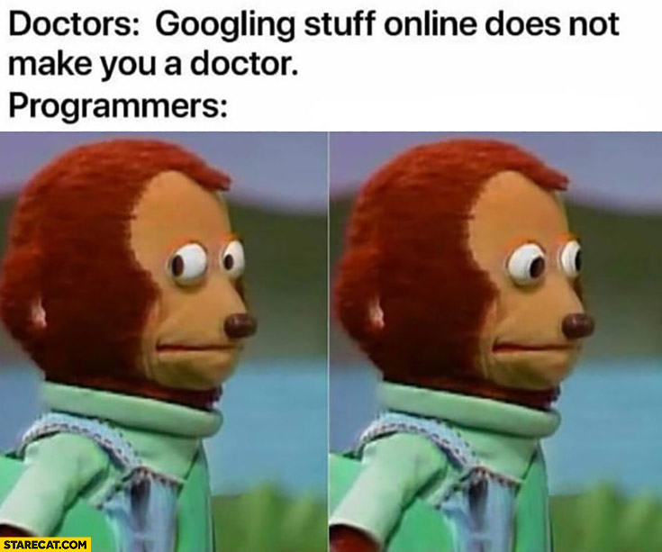

## Statistical Programming and Open Science Methods Course

### Welcome! 

This is the repository to a brand-new and in-development statistical 
programming and open science course. It is being developed by me (Joachim 
Gassen) and is being offered under the research program of the 
[TRR 266 "Accounting for Transparency"](https://www.accounting-for-transparency.de).

It communicates how to conduct data-based research so that others can contribute
and collaborate. This involves making your research data and methods FAIR 
(findable, accessible, interoperable and reusable) and your results reproducible. 

After this course, participants will

-	be able to use common collaboration tools in software development like 
  Git and Github,
- know how to set up a portable and time-independent development environment
  in a docker container,
-	understand how to use functional and object-oriented programming approaches 
  to develop accessible code,
-	be capable to develop test routines and debug code,
-	have gained an understanding on how to profile code,
-	have developed routines for standard data analysis tasks, like data scraping, 
  cleaning and visualization, 
-	have understood how to package statistical applications so that they are 
  portable across platforms, and
- be able to provide FAIR data and methods as well as replication kits to the
  scientific community.


### Course format

The course consists of two block sessions covering two days each and online 
assignments and group work in between. Students are free to prepare their 
assignments using a statistical programming language of their choice.

While the course is designed as a blended learning event, it might also
be useful for self-study. To do so:

- Set up the development environment as described below.
- Produce data, slides and additional info by running `make all`.
- Work through the slides for Topics 1 to 9. Doing so, it is also useful to take
  a look at the source code of the slides if you are familiar with R.
- Work with the literature that is provided in the 
  [link list](docs/link_list.md) and on the slides.
- Try your luck with the individual assignments. They will be announced as GitHub
  issues throughout the period October 2019 to January 2020.
- Pick a small project that you expect to contribute to the Open Science
  community. This could be, e.g., a project generating code that collects 
  publicly available but not easily obtainable data, tidies and documents it 
  and provides simple tools for exploration and export. Alternatively, it could 
  be a collection of tools in your area of methodological or domain expertise, 
  ideally distributed as a package. See the 
  [ROpenSci project](https://ropensci.org) for inspiration. Or, you could 
  provide a fully-functional replication kit for one of your current or past
  research projects.
- While working on your project, work through the second batch of the slide
  deck. It will become available in mid-February 2020.
- Produce and make your open science work available to the world.
- Share your knowledge and maintain what you have done.

  
### Prerequisites

Intermediate skills in statistics and knowledge of a statistical 
programming language  (e.g., Python, R or Stata) are required. We will mostly
work with R during the seminar but students are free to use other languages for 
their assignments if they prefer. Students that are not familiar with R are 
strongly encouraged to work through the opening chapters of 
[R for data science by Garrett Grolemund and Hadley Wickham](https://r4ds.had.co.nz)
prior to attending the course.


### About the repository

This repository follows a "fork and pull request" workflow. Only I can 
commit to the repository directly. You can and should fork your 
own versions of this repository, make changes by committing to your repository
and then issue a pull request if you think that your changes should be included
in this repository.

The directory structure might grow over time. Currently we have ...

- `code`: This is where our code will go.
- `docker`: Contains the docker file for our IDE container.
- `docs`: Documents or link lists that might be helpful. 
- `slides`: The source code for the slides that I plan to use in class.
- `raw_data`: Here we will store data that we receive from external sources.
- `resources`: Other external documents that we might use

... and some directories that will store output from our coding adventures.
Do not commit anything to these directories.

- `data`: Here we will store data that is being generated by code.
- `output`: Here we will store all non-data output (e.g., tables and figures).


### Setting up the environment: The local way

**NOTE: This step requires you to make substantial changes to your computing 
environment by installing various additional software. If you do not like that
idea, consider using docker instead. This is generally a good idea as we will
be using docker anyhow to build portable development environments and 
replication kits. See below.**

You need the following to run the code of the repository (Installation links for 
Windows in brackets)

- git: https://gitforwindows.org
- R > 3.5.0: https://cloud.r-project.org
- Free version of Rstudio: https://rstudio.com/products/rstudio/download/ 
- RTools (including make): https://cran.r-project.org/bin/windows/Rtools/
  Make sure that you include the Rtools directory in your path (you are asked
  about this during the installation). **NOTE: If you happen other GNU tools
  installed already (Cygwin or MinGW), please do not install RTools.** Instead,
  verify that make is available and included in your path. **NOTE: If you are
  on MacOS, you do not need RTools.** Instead, install the XCode command line
  tools: https://railsapps.github.io/xcode-command-line-tools.html.
- Python3: https://www.python.org/downloads/

After installing these programs, fork this repository on GitHub.

Once you have this up and running start RStudio. Create a new project ("File -> 
New Project -> Version Control"). Provide the link to your forked directory and 
choose a local directory that will receive the cloned repository. 

After cloning your fork, you will have to install several packages in R that 
the code relies on. Run the following in the R console (lower left corner).

```
install.packages(c('tidyverse', 'devtools', 'rmarkdown', 'kableExtra',
'ExPanDaR', 'ggmap', 'tidyr', 'tufte', 'showtext', 'cowplot', 'DiagrammeR',
'leaflet', 'widgetframe', 'zipcode', 'shiny', 'shinyjs', 'grid', 'gridExtra',
'ggwordcloud', 'tm', 'qrcode'), 
repos = c(CRAN = 'https://mran.microsoft.com/snapshot/2019-09-25'))

devtools::install_github('bergant/datamodelr')
devtools::install_github('wmurphyrd/fiftystater')
webshot::install_phantomjs()
```

Continue with "Produce all Output" below.


### Setting up the environment: The docker way

First you need install docker. When you have
new version of MacOS or Windows 10 Professional/Enterprise installed: https://docs.docker.com/get-started/. **Read the introductions
for your operating system.** They are important.

If you happen to have an older/less expensive version of Windows then docker 
toolbox is your choice: https://docs.docker.com/toolbox/. 
**Read the introductions for your operating system.** They are important.

After installing docker, verify that it is running by opening a shell/terminal
and issuing the command `docker` (in the black toolbox window if you run docker
toolbox). You should see a help text. If you see the help text, change to the
project directory `docker` and follow the instruction in the Dockerfile.

Once you have logged into the docker instance on the "web page" running RStudio,
create a new project within the RStudio instance running in your container
("File -> New Project -> Existing Directory"). Select the `sposm` directory.

Add your forked repository as the main remote to git.

```
git remote remove origin
git remote add origin https://github.com/YOURACCOUNT/sposm.git
git remote -v
```

The last command verifies that the new remote points to your forked 
repository. 


### Produce all Output (data and slides)

Now you have your `sposm` project initialized. Test whether you can run all code
to produce the data, the slides and the link list in the data directory. In the 
Terminal (lower left corner) run:

```
make all
```

### Setting up git to allow syncing your fork with the main repository

To add the main repository as an additional repository with the name `upstream`, 
open the terminal (lower left corner) and add the remote.

```
git remote add upstream https://github.com/joachim-gassen/sposm.git
git remote -v
```

To keep your fork in sync with the main repository, you need to follow the
strategy explained here: https://help.github.com/en/articles/syncing-a-fork.
Additional helpful info can be found here: 
https://gist.github.com/CristinaSolana/1885435. 
If this is not sufficient to update your forked repository on Github, have a look here:
https://stackoverflow.com/questions/7244321/how-do-i-update-a-github-forked-repository

In a nutshell: Work-flow assuming that you have your forked remote repository
as `origin` and the main repository as `upstream` and are working in your 
local repository directory:

```
# make the changes from the main repository available locally

git fetch upstream

# Switch to your local main branch

git checkout master

# Use only one of the two below. See slide deck 2 for the difference between
# merging and rebasing. Normally rebasing is only needed when you have changes
# in your repo that you want to issue a pull request for after rebasing.

# Alternative A: Merge the changes from upstream

git merge upstream/master

# Alternative B: rebase your local branch on upstream

git rebase upstream/master

# If this has worked out, make sure to push your chnanges to your own remote
# The --force-with-lease is only needed when you are rebasing.

git push --force-with-lease origin master
```

### Tips and Tricks

#### If knitting fails...

If you are having issues knitting the slides this might be because  `datamodelr` 
is not yet available on the CRAN. To install `datamodelr` from GitHub, run:

```
install.packages("devtools") # NOTE: you may have devtools already installed
devtools::install_github("bergant/datamodelr")
```

#### If localhost:8787 fails...

When you use docker toolbox the docker container is not hosted on localhost but
instead on a dedicated virtual machine that has a unique IP address. See the
Dockerfile for more detail.


### Disclaimer

<p align="center">

</p>


